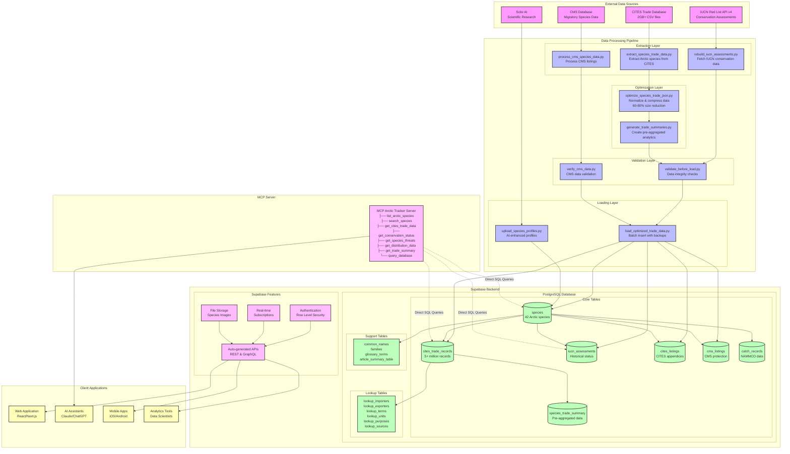
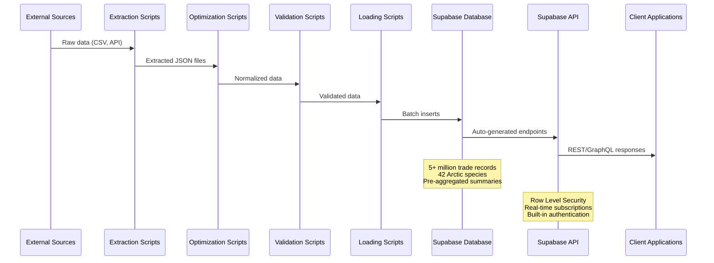
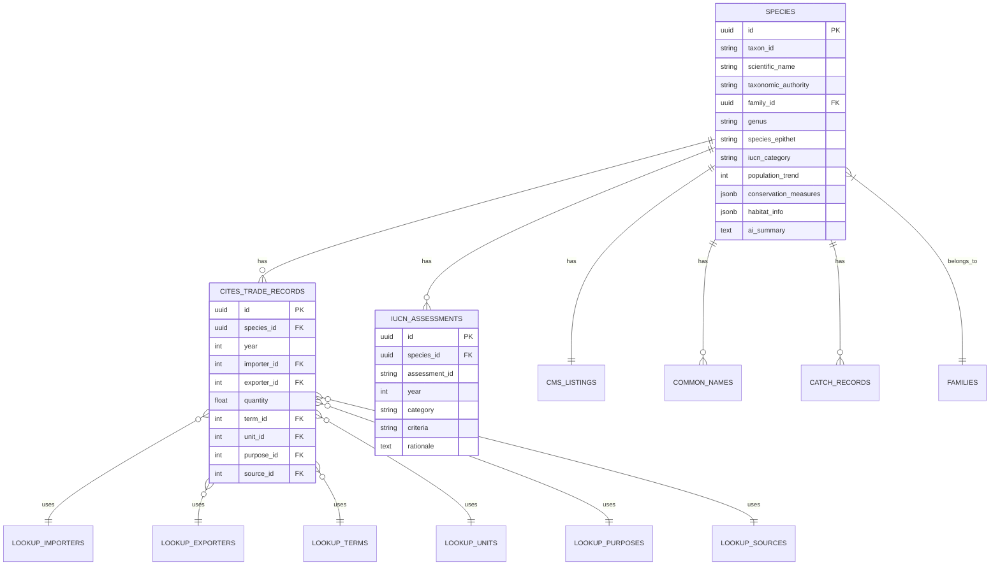

# Arctic Tracker API Backend Architecture

## System Overview

This document provides a visual representation of the Arctic Tracker API backend architecture using Mermaid diagrams.

## Architecture Diagram



## Data Flow Sequence



## Database Schema Overview



## Key Features

### 1. **Performance Optimizations**
- Normalized data with lookup tables (60-80% storage reduction)
- Pre-aggregated summaries for instant queries
- Composite indexes on frequently queried columns
- Full-text search capabilities

### 2. **Data Pipeline Automation**
- Automated extraction from multiple sources
- Data validation and integrity checks
- Batch processing for large datasets
- Automatic backup creation

### 3. **Security & Access Control**
- Row Level Security (RLS) policies
- Environment-based configuration
- Service role keys for admin operations
- Input validation and sanitization

### 4. **Integration Capabilities**
- MCP server for AI assistant integration
- Auto-generated REST and GraphQL APIs
- Real-time data subscriptions
- Direct SQL query access for advanced users

## Usage Examples

### Running the Data Pipeline

```bash
# 1. Extract species data from CITES
cd core
python extract_species_trade_data.py --mode full

# 2. Optimize the extracted data
python optimize_species_trade_json.py

# 3. Validate before loading
python validate_before_load.py

# 4. Load to database with backup
python load_optimized_trade_data.py --backup

# 5. Generate trade summaries
python generate_trade_summaries.py
```

### API Endpoints

```bash
# Get all Arctic species with conservation status
GET /rest/v1/species?select=*,iucn_assessments(*),cites_listings(*)

# Get trade records for Polar Bear
GET /rest/v1/cites_trade_records?species_id=eq.{polar_bear_uuid}&year=gte.2020

# Get pre-aggregated trade summary
GET /rest/v1/species_trade_summary?species_id=eq.{species_uuid}
```

### MCP Server Usage

```javascript
// List endangered Arctic species
await mcp.list_arctic_species({
  conservation_status: "EN",
  class: "MAMMALIA"
});

// Search for species by name
await mcp.search_species({
  query: "polar bear",
  search_type: "common_name"
});

// Get trade data with filters
await mcp.get_cites_trade_data({
  species_id: "uuid",
  year: 2023,
  purpose: "T"  // Commercial trade
});
```

## Production Infrastructure

- **Database**: Supabase (PostgreSQL 15)
- **API**: Auto-generated REST & GraphQL
- **File Storage**: Supabase Storage for images
- **Authentication**: Supabase Auth with RLS
- **Monitoring**: Built-in Supabase dashboard
- **Backups**: Automated daily backups

## Maintenance Scripts

The system includes several maintenance and utility scripts:

- `update_db_architecture_and_species.py` - Generate database documentation
- `test_supabase_connection.py` - Verify database connectivity
- `create_backup.py` - Manual backup creation
- `restore_from_backup.py` - Restore data from backups

---

*Last Updated: August 2025*
*Arctic Tracker API v1.0*